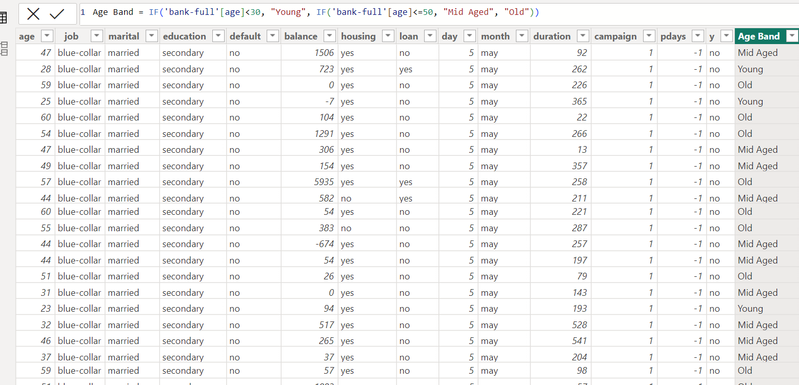

# PowerBI-Task4

#### Introduction:

The ability to derive meaningful insights from data is paramount. This is where Data Analysis Expressions (DAX) functions in Power BI come into play.

The DAX functions serve as powerful tools in Power BI for performing calculations and aggregations and they help to derive meaningful insights and metrics from the dataset.

These DAX functions are used to gain deeper insights, perform advanced analyses, and create customized measures and columns that suit specific business needs. DAX functions provide the flexibility and functionality necessary for robust data modeling and reporting in Power BI.

#### Problem Statement:
1. Create a measure for the ‘Average age of depositors’
2. Create a new column named ‘Age band’ containing the following:
-  ‘Young’ for ages below 30
-  ‘Mid Aged’ for ages between 30 and 50 
-  ‘Old’ for ages above 50
3. Create a measure calculating the total balance for:
- Job: Technician
- Marital: Single and married
4. Create a measure to get the number of depositors on loan

#### Results/Discussion

The snapshot below shows the average age of depositors and The DAX function used is as follows;

_Average Age of Depositors = CALCULATE(AVERAGE('bank-full'[age]),FILTER('bank-full','bank-full'[loan]="Yes"))_

The screenshot above indicates the specified categories based on age ranges and the DAX function used is as follows;

_Age Band = IF('bank-full'[age]<30, "Young", IF('bank-full'[age]<=50, "Mid Aged", "Old"))_

The screenshot below shows the calculated total balance for individuals with a job of technician and marital status of “single” or “married”. The Functions used are;

_Total Balance by Job (Technician) = CALCULATE(SUM('bank-full'[balance]),FILTER('bank-full','bank-full'[job]="Technician"))_

AND

_Total Balance by Married and Single = CALCULATE(SUM('bank-full'[balance]), FILTER('bank-full', 'bank-full'[marital]="Single" || 'bank-full'[marital]="Married"))_

The screenshot above shows the calculated number of depositors on loan and the function used is as follows;

_Number of Depositors on loan = CALCULATE(COUNT('bank-full'[loan]), FILTER('bank-full', 'bank-full'[loan]="Yes"))_

#### Conclusion:

In this analysis, key insights using DAX functions and visualizations were explored.

The average number of depositors on loans was determined using The DAX function. This shows that age is a critical factor in understanding the customer base.

Next, depositors into age bands were categorized using the DAX function. This categorization into "Young," "Mid-Aged," and "Old" based on age ranges provide a clearer insight.

Also, The total balance of individuals working as technicians and those with marital statuses of "Single" or "Married.” were determined. The 'Total Balance by Job (Technician)' and 'Total Balance by Married and Single' highlight the importance of occupation and marital status in financial profiles.

Overall, this analysis shows the power of DAX functions and visualizations in extracting meaningful insights and informed decisions.

